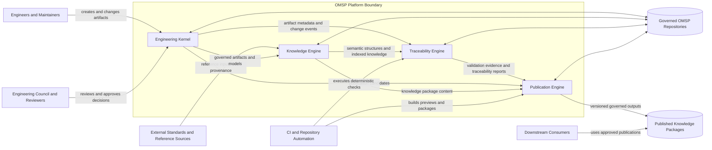
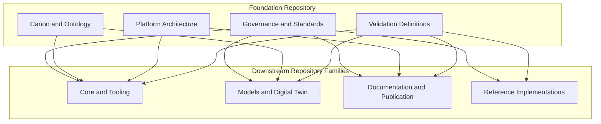
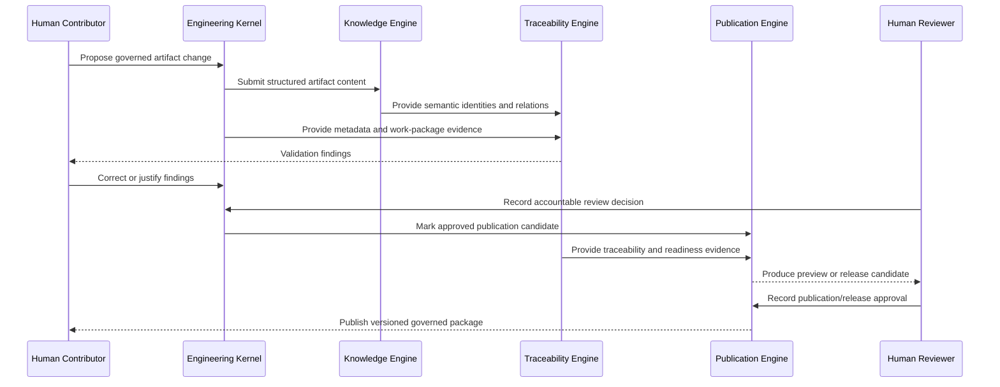

# OMSP Platform Context

## 1. Purpose

This artifact defines the top-level OMSP platform boundary, external actors, repository boundaries and engine interactions. It is a maintainable C4-style context view expressed in Mermaid and governed Markdown.

## 2. Diagram Source Decision

Mermaid is the canonical diagram source for Sprint-2 because it is text-based, reviewable in pull requests and rendered natively by GitHub. Exported images may be produced for publication, but they are derived artifacts and do not replace this source.

## 3. System Context

## 4. External Actors

| Actor | Responsibility | Authority Boundary |
| --- | --- | --- |
| Engineers and Maintainers | Create, update and propose governed artifacts and models. | Cannot self-approve material governance, baseline or release decisions unless assigned authority permits it. |
| Engineering Council and Reviewers | Review architecture, governance, baseline and release proposals. | Sole accountable human approval boundary for governed decisions. |
| Downstream Consumers | Use approved knowledge packages, models and references. | Consumption does not change source authority. |
| External Standards and Reference Sources | Supply standards, regulations, manufacturer material and domain references. | Inputs require provenance; external content is not automatically OMSP authority. |
| CI and Repository Automation | Execute deterministic validation, reports and publication builds. | Automation may detect and report; it cannot approve. |

## 5. OMSP Platform Boundary

The platform boundary contains four logical engines:

- **Engineering Kernel** manages governed engineering work and artifact creation.
- **Knowledge Engine** structures, indexes and relates governed knowledge.
- **Traceability Engine** validates identity, metadata, relations and evidence.
- **Publication Engine** assembles eligible governed content into versioned outputs.

The platform boundary does not include accountable human governance authority. Human reviewers interact with the platform but remain external decision authorities.

## 6. Repository Boundary View

Foundation artifacts provide authority and contracts. Downstream repositories implement or consume them through stable Artifact IDs and explicit traceability relations.

## 7. Engine Interaction View

## 8. Trust and Authority Boundaries

1. Repository content is not authoritative solely because it exists on a branch.
2. Draft and review artifacts remain distinguishable from Active, baseline and release artifacts.
3. Engine outputs are proposals, validations, indexes or packages; none confer human approval.
4. External inputs require source, version and provenance metadata.
5. Published outputs must retain links to canonical Artifact IDs and source repository state.

## 9. Change Rules

Material changes to actors, platform boundary, engine responsibilities or trust boundaries require architecture review. Diagram updates must remain consistent with `PLATFORM_ARCHITECTURE.md` and the four engine artifacts.
