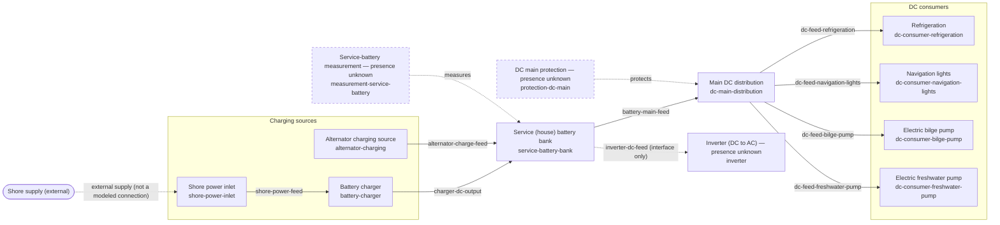

# Hanse 460 Electrical Slice — Energy-Chain Diagram View (MDS v0.1)

## 1. View declaration

- **View class:** energy-chain view
  ([`MDS-MARINE-DIAGRAM-SYSTEM.md`](../../../publication/mods/MDS-MARINE-DIAGRAM-SYSTEM.md)
  §2.1, `OMSP-MODS-MDS-0001`; declared per ODS-400-R-07).
- **Derived from:** the WP-0082 electrical-slice model package
  ([`../README.md`](../README.md), `OMSP-REFERENCE-HANSE460-ELECTRICAL-0001`,
  package version 0.1.x, schema contract 0.2.0). This diagram is a
  **derived structural view**: it introduces no element absent from the
  model (ODS-400-R-01) and renders no attribute values (MDS §2.1
  value rule).
- **First applied MDS instance:** this artifact is the first conformance
  exercise of the MDS v0.1 notation (golden-path energy chain,
  `OMSP-PLANNING-GOLDEN-PATH-0001` §7.1).

## 2. Diagram source (canonical, MDS-R-10)

## 3. Identifier mapping tables (MDS-R-08 / ODS-400-R-06)

### 3.1 Nodes

| Node key | Model element ID | Source file |
| --- | --- | --- |
| `shore` | External boundary — no model element (MDS-R-03); feeds port `port:equipment:configuration:vessel-design:hanse:460:reference-0.1.0:shore-power-inlet:shore-supply-in` | — |
| `spi` | `equipment:configuration:vessel-design:hanse:460:reference-0.1.0:shore-power-inlet` | [`../equipment-shore-power-inlet.yaml`](../equipment-shore-power-inlet.yaml) |
| `chg` | `equipment:configuration:vessel-design:hanse:460:reference-0.1.0:battery-charger` | [`../equipment-battery-charger.yaml`](../equipment-battery-charger.yaml) |
| `alt` | `equipment:configuration:vessel-design:hanse:460:reference-0.1.0:alternator-charging` | [`../equipment-alternator-charging.yaml`](../equipment-alternator-charging.yaml) |
| `bat` | `equipment:configuration:vessel-design:hanse:460:reference-0.1.0:service-battery-bank` | [`../equipment-service-battery-bank.yaml`](../equipment-service-battery-bank.yaml) |
| `dcd` | `equipment:configuration:vessel-design:hanse:460:reference-0.1.0:dc-main-distribution` | [`../equipment-dc-main-distribution.yaml`](../equipment-dc-main-distribution.yaml) |
| `con1` | `equipment:configuration:vessel-design:hanse:460:reference-0.1.0:dc-consumer-refrigeration` | [`../equipment-dc-consumer-refrigeration.yaml`](../equipment-dc-consumer-refrigeration.yaml) |
| `con2` | `equipment:configuration:vessel-design:hanse:460:reference-0.1.0:dc-consumer-navigation-lights` | [`../equipment-dc-consumer-navigation-lights.yaml`](../equipment-dc-consumer-navigation-lights.yaml) |
| `con3` | `equipment:configuration:vessel-design:hanse:460:reference-0.1.0:dc-consumer-bilge-pump` | [`../equipment-dc-consumer-bilge-pump.yaml`](../equipment-dc-consumer-bilge-pump.yaml) |
| `con4` | `equipment:configuration:vessel-design:hanse:460:reference-0.1.0:dc-consumer-freshwater-pump` | [`../equipment-dc-consumer-freshwater-pump.yaml`](../equipment-dc-consumer-freshwater-pump.yaml) |
| `inv` | `equipment:configuration:vessel-design:hanse:460:reference-0.1.0:inverter` | [`../equipment-inverter.yaml`](../equipment-inverter.yaml) |
| `prot` | `equipment:configuration:vessel-design:hanse:460:reference-0.1.0:protection-dc-main` | [`../equipment-protection-dc-main.yaml`](../equipment-protection-dc-main.yaml) |
| `meas` | `equipment:configuration:vessel-design:hanse:460:reference-0.1.0:measurement-service-battery` | [`../equipment-measurement-service-battery.yaml`](../equipment-measurement-service-battery.yaml) |

`presence unknown` markers (MDS-R-07): the inverter is modeled with
presence explicitly unknown (factory option path, model README §4); the
protection and measurement roles are OMSP reference structure with no
captured source establishing any concrete device (model README §3).

### 3.2 Edges — realized connections (MDS-R-04)

All connection IDs carry the prefix
`connection:configuration:vessel-design:hanse:460:reference-0.1.0:` —
the table shows the full ID; port endpoints are quoted from the
connection instance files.

| Edge label | Connection ID | `source_port` | `target_port` | Source file |
| --- | --- | --- | --- | --- |
| `shore-power-feed` | `connection:configuration:vessel-design:hanse:460:reference-0.1.0:shore-power-feed` | `port:equipment:configuration:vessel-design:hanse:460:reference-0.1.0:shore-power-inlet:ac-out` | `port:equipment:configuration:vessel-design:hanse:460:reference-0.1.0:battery-charger:ac-in` | [`../connection-shore-power-feed.yaml`](../connection-shore-power-feed.yaml) |
| `charger-dc-output` | `connection:configuration:vessel-design:hanse:460:reference-0.1.0:charger-dc-output` | `port:equipment:configuration:vessel-design:hanse:460:reference-0.1.0:battery-charger:dc-out` | `port:equipment:configuration:vessel-design:hanse:460:reference-0.1.0:service-battery-bank:charge-in` | [`../connection-charger-dc-output.yaml`](../connection-charger-dc-output.yaml) |
| `alternator-charge-feed` | `connection:configuration:vessel-design:hanse:460:reference-0.1.0:alternator-charge-feed` | `port:equipment:configuration:vessel-design:hanse:460:reference-0.1.0:alternator-charging:dc-out` | `port:equipment:configuration:vessel-design:hanse:460:reference-0.1.0:service-battery-bank:charge-in` | [`../connection-alternator-charge-feed.yaml`](../connection-alternator-charge-feed.yaml) |
| `battery-main-feed` | `connection:configuration:vessel-design:hanse:460:reference-0.1.0:battery-main-feed` | `port:equipment:configuration:vessel-design:hanse:460:reference-0.1.0:service-battery-bank:supply-out` | `port:equipment:configuration:vessel-design:hanse:460:reference-0.1.0:dc-main-distribution:feed-in` | [`../connection-battery-main-feed.yaml`](../connection-battery-main-feed.yaml) |
| `dc-feed-refrigeration` | `connection:configuration:vessel-design:hanse:460:reference-0.1.0:dc-feed-refrigeration` | `port:equipment:configuration:vessel-design:hanse:460:reference-0.1.0:dc-main-distribution:out-refrigeration` | `port:equipment:configuration:vessel-design:hanse:460:reference-0.1.0:dc-consumer-refrigeration:dc-in` | [`../connection-dc-feed-refrigeration.yaml`](../connection-dc-feed-refrigeration.yaml) |
| `dc-feed-navigation-lights` | `connection:configuration:vessel-design:hanse:460:reference-0.1.0:dc-feed-navigation-lights` | `port:equipment:configuration:vessel-design:hanse:460:reference-0.1.0:dc-main-distribution:out-navigation-lights` | `port:equipment:configuration:vessel-design:hanse:460:reference-0.1.0:dc-consumer-navigation-lights:dc-in` | [`../connection-dc-feed-navigation-lights.yaml`](../connection-dc-feed-navigation-lights.yaml) |
| `dc-feed-bilge-pump` | `connection:configuration:vessel-design:hanse:460:reference-0.1.0:dc-feed-bilge-pump` | `port:equipment:configuration:vessel-design:hanse:460:reference-0.1.0:dc-main-distribution:out-bilge-pump` | `port:equipment:configuration:vessel-design:hanse:460:reference-0.1.0:dc-consumer-bilge-pump:dc-in` | [`../connection-dc-feed-bilge-pump.yaml`](../connection-dc-feed-bilge-pump.yaml) |
| `dc-feed-freshwater-pump` | `connection:configuration:vessel-design:hanse:460:reference-0.1.0:dc-feed-freshwater-pump` | `port:equipment:configuration:vessel-design:hanse:460:reference-0.1.0:dc-main-distribution:out-freshwater-pump` | `port:equipment:configuration:vessel-design:hanse:460:reference-0.1.0:dc-consumer-freshwater-pump:dc-in` | [`../connection-dc-feed-freshwater-pump.yaml`](../connection-dc-feed-freshwater-pump.yaml) |

### 3.3 Edges — interface-only, external, and relation edges (MDS-R-03/05/06)

| Edge label | Kind | Traces to | Source file |
| --- | --- | --- | --- |
| `inverter-dc-feed (interface only)` | Interface without realizing connection (MDS-R-05) | `interface:configuration:vessel-design:hanse:460:reference-0.1.0:inverter-dc-feed` (`source_port` `port:equipment:configuration:vessel-design:hanse:460:reference-0.1.0:service-battery-bank:supply-out`, `target_port` `port:equipment:configuration:vessel-design:hanse:460:reference-0.1.0:inverter:dc-in`); no connection instance exists (option path, model README §4) | [`../interface-inverter-dc-feed.yaml`](../interface-inverter-dc-feed.yaml) |
| `external supply (not a modeled connection)` | External-boundary edge (MDS-R-03) | Port `port:equipment:configuration:vessel-design:hanse:460:reference-0.1.0:shore-power-inlet:shore-supply-in`; the shore supply itself is outside the modeled slice | [`../equipment-shore-power-inlet.yaml`](../equipment-shore-power-inlet.yaml) |
| `protects` (drawn: `prot` → `dcd`) | Model relation edge (MDS-R-06) | `protects` list of the protection role. **Not drawn (MDS-R-06 limitation):** the same role also protects the connection `connection:configuration:vessel-design:hanse:460:reference-0.1.0:battery-main-feed`; recorded here because a flowchart edge cannot target another edge | [`../equipment-protection-dc-main.yaml`](../equipment-protection-dc-main.yaml) |
| `measures` (drawn: `meas` → `bat`) | Model relation edge (MDS-R-06) | `measures` fields of the role's measurement points (voltage and current observation points, both targeting `equipment:configuration:vessel-design:hanse:460:reference-0.1.0:service-battery-bank`) | [`../equipment-measurement-service-battery.yaml`](../equipment-measurement-service-battery.yaml) |

## 4. Notation-to-rule mapping (MDS-R-12)

Every notation element used above traces to an MDS v0.1 rule:

| Notation element in this diagram | MDS rule |
| --- | --- |
| Mermaid `flowchart` source in a fenced block, in `diagrams/` of the model package | MDS-R-01, MDS-R-10 |
| Rectangular nodes with name + local ID label (`spi`, `chg`, `alt`, `bat`, `dcd`, `con1`–`con4`, `inv`, `prot`, `meas`) | MDS-R-02 |
| Stadium node `shore` labeled `(external)` with dotted labeled edge into the slice | MDS-R-03 |
| Solid labeled arrows for the eight connection instances, direction `source_port` → `target_port` | MDS-R-04 (ODS-400-R-04) |
| Dotted arrow `inverter-dc-feed (interface only)` | MDS-R-05 (ODS-400-R-03) |
| Dashed-border annotation nodes (`classDef annotation`) with dotted `protects` / `measures` edges; edge-target relation recorded in table §3.3 | MDS-R-06 |
| Textual `presence unknown` markers on `inv`, `prot`, `meas` | MDS-R-07 (ODS-400-R-05) |
| Mapping tables in Section 3 | MDS-R-08 (ODS-400-R-06) |
| No color styling; distinctions by line style and node shape only | MDS-R-09 |
| Left-to-right energy flow, sources → consumers | MDS §2.1 reading direction |
| View-class declaration in Section 1 | MDS-R-11 (ODS-400-R-07) |

## 5. Derivation and consistency note (MDS-R-11)

This diagram source was authored by hand as a transcription of the model
package structure (no diagram generator exists yet; automated generation
is MDS Reserved §6.5). Consistency was checked manually: every equipment
instance file of the package appears as exactly one node; every
connection instance file appears as exactly one solid edge whose
direction matches the instance's `source_port`/`target_port`; the single
connectionless interface appears as the one dotted interface-only edge.
Corrections go into the model or this source, never into any rendered
image (ODS-400-R-09).

## 6. Safety and authority boundary

This view inherits the boundary of its model package
([`../README.md`](../README.md) §9): advisory reference data for a
design-family configuration; no specific hull; no certification,
compliance, seaworthiness, or operational-fitness meaning; not an
operational instruction. Every safety-relevant conclusion requires
accountable human judgment
([`../../DIGITAL_TWIN_GOVERNANCE_AND_SAFETY_BOUNDARIES.md`](../../DIGITAL_TWIN_GOVERNANCE_AND_SAFETY_BOUNDARIES.md)).
